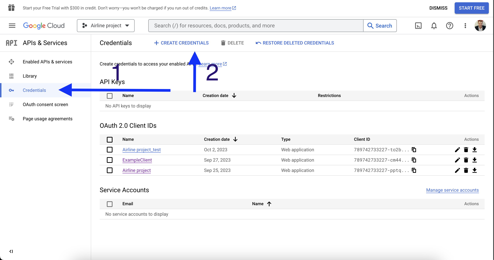

# Логика работы Airline-oauth

На текущий момент сервис настроен на получение токена аутентификации через Google Identity.
После получения данных от Google, сервис переадресовывает пользователя обратно во фронт(8082) и в будущем способен отдавать principal и googleUser в бэк(8080)

### Схема работы под "капотом"

1. При нажатии кнопки "Вход с google" на фронте, пользователя переадресовывает на страницу http://localhost:8084/login/oauth2/code/google
2. После успешного входа в учетную запись Google и разрешения передачи данных в Airline project, Google возвращает токен
3. Токен полученный от Google преобразовывается в Principal и имеет полезную нагрузку в виде JSON а также может преобразовываться в строку с помощью метода toString.
   Строка имеет вид:
   - OAuth2AuthenticationToken [Principal=Name: [109899425711459554508], Granted Authorities: [[ROLE_USER, SCOPE_https://www.googleapis.com/auth/userinfo.email, SCOPE_https://www.googleapis.com/auth/userinfo.profile, SCOPE_openid]], User Attributes: [{at_hash=kQp3Z_B5WOgvx8fFK8-JUQ, sub=109899425711459554508, email_verified=true, iss=https://accounts.google.com, given_name=Artem, locale=ru, nonce=oS8Ls6-ZVuTcp5EDOWZDLZ-FI1RtcLW4vjj9LBz79bk, picture=https://lh3.googleusercontent.com/a/ACg8ocKCGJTMu_lkMM6QpbMRooyOPiMHIRsitU4KnFp7vHmmlA=s96-c, aud=[789742733227-cm44o0vdkqn734ng26rqb0bg4qbivq5n.apps.googleusercontent.com], azp=789742733227-cm44o0vdkqn734ng26rqb0bg4qbivq5n.apps.googleusercontent.com, name=Artem Katsevich, exp=2023-10-03T08:04:23Z, family_name=Katsevich, iat=2023-10-03T07:04:23Z, email=greatdolphin94@gmail.com}], Credentials=[PROTECTED], Authenticated=true, Details=WebAuthenticationDetails [RemoteIpAddress=0:0:0:0:0:0:0:1, SessionId=EEF3ECAE220F90182F9872E70410C018], Granted Authorities=[ROLE_USER, SCOPE_https://www.googleapis.com/auth/userinfo.email, SCOPE_https://www.googleapis.com/auth/userinfo.profile, SCOPE_openid]]
   ### Tip:
   #### Обратите внимание, что Principal.getName = возвращает не имя пользователя, а его Google ID

4. После успешной аутентификации в Google, пользователя переадресовывает на http://localhost:8084/
5. В контроллере RedirectController по данному адресу запускается метод redirectToAnotherPort, который принимает в качестве аргумента Principal. Метод запускает цепочку действий:
   - Маппит Principal в модель GoogleUser с помощью сервисного класса GoogleUserParser (вытаскиваются given_name, family_name, email)
   - Передает GoogleUser и Principal в сервисный класс RedirectUserData
   - переадресовывает пользователя обратно на http://localhost:8082/

### Дополнительно об Airline-oauth

Сервис полностью настроен для работы с Google Identity и позволяет получать токен для дальнейшей его обработки.
На текущий момент не реализована передача Principal и Google, для этого следует создать соответсвующий Api на стороне project Airlines. Данные во фронт после реализации API можно передавать через Feign client

### Устранение проблем
В случае если google начал блокировать редирект обратно на порт localhost:8084, вам требуется пересоздать API ID и обновить их в файле настроек properties.yaml
Для этого следуйте следующим шагам:
1. Перейдите на страницу https://console.cloud.google.com/apis
2. Войдите под записью Google, которую предоставит тимлид
3. Перейдите на вкладку "Credentials" и нажмите "CREATE Credentials" как на скриншоте:

4. Нажмите "oauth client ID":

5. В выпадающем окне Application Type выберите web client
6. В поле "Name" укажите любое имя, рекомендуется "Airline project"
7. В разделе "Authorized redirect URIs" нажмите "Add URI"
8. В качестве URI укажите http://localhost:8084/login/oauth2/code/google

9. Скопируйте client id и client secret в соответствующие поля в properties.yaml
