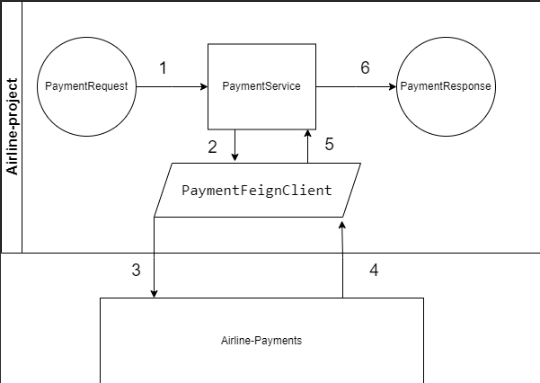
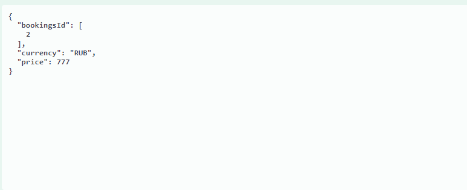
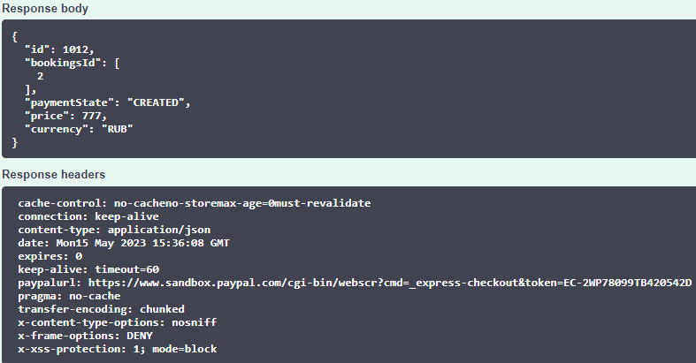

# Логика работы Airline-payments

На данный момент вся логика работы сервиса оплаты сводится к получению ссылки Paypal к вашему созданному платежу.

### Схема взаимодействия сервисов

1. PaymentRestController получает запрос на сохранения платежа с RequestPayment (PaymentDTO без заполнения id, статуса платежа)
2. PaymentRestController передаёт RequestPayment в PaymentService, который проверяет обозначенные места бронирования на существование и сохраняет в БД платёж, получает статус платежа и id.
3. Мы создаём Data Transfer Object Response (PaymentResponse) и отправляем его в Airline-Payments с помощью PaymentFeignClient
4. Airline-payments возвращает нам ResponseEntity с ссылкой на оплату в Paypal, которая находится в headers.
5. PaymentService возвращает полученный ответ в PaymentRestController
6. В ответе на запрос мы получаем PaymentResponse со всеми данными и ссылкой на оплату в заголовке. Тело ответа с данными платежа показано
для проверки и наглядного полученного результата, а ссылка в заголовке для возможности дальнейшего перенаправления на сайт для оплаты.
Примеры запроса и ответа показаны ниже.

### Более подробная реализация Airline-payments

В сервисе находится SDK Paypal и реализация создания Paypal payments(sandbox типа т.е тестового), который генерирует нам ссылку с оплатой, исходя из полученных данных - цены, валюты, метода.
Также имеется возможность в платеже выставить ссылки, на которые нас перебросит в случае отмены платежа и в случае оплаты (в будущем возможно расширить этот функционал).
Также в properties установлены ключи для работы с Paypal. Данные от аккаунтов находятся у тех.лида. С помощью этих ключей мы формируем токен, который интегрируется в платёж.

