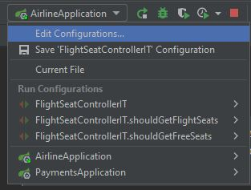
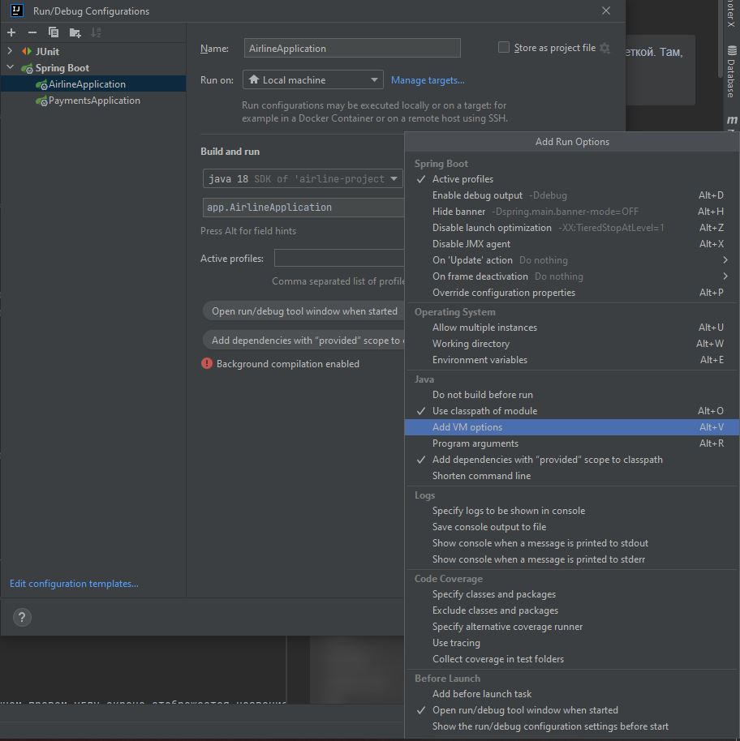
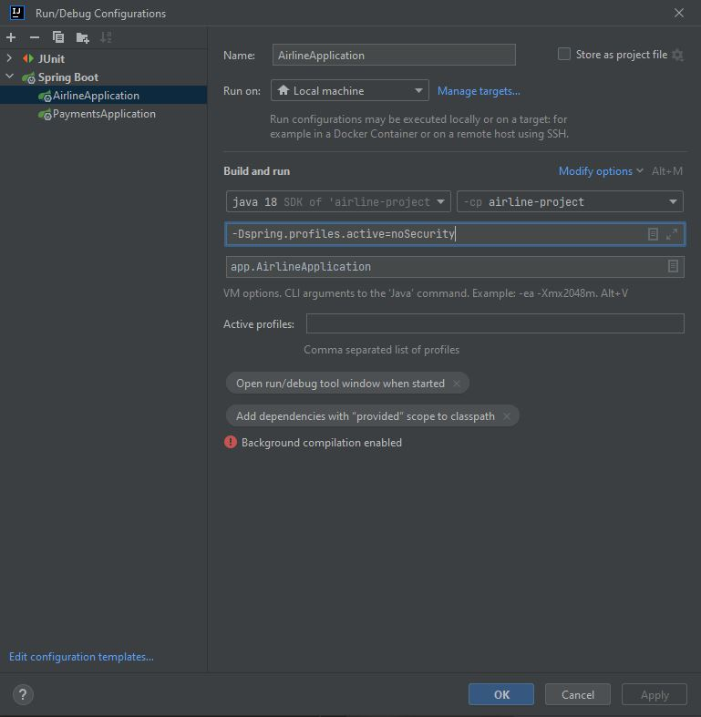

## Postman
Postman - это стандартный инструмент разработчиков, тестировщиков и даже аналитиков для тестирования API. Он нужен для выполнения заранее созданных запросов к тестируемому приложению. 

[Скачать тут](https://www.postman.com/downloads/)

## Импорт данных в Postman

Благодаря maven-плагину springdoc-openapi-maven-plugin, при комплияции проекта генерируется .json файл со спецификацией [OpenAPI](./guide_swagger.md) и помещается в корень репозитория. Этот файл необходимо импортировать в ваш Postman для создания коллекции запросов:
1) Откройте Postman, в верхней левой части окна найдите кнопку Import и нажмите на нее
2) Выберите файл из нашего репозитория **S7_Airlines_API.postman_collection.json**

Вы можете использовать эти запросы для тестирования кода, который вы написали, для ознакомления с работой приложения или для поиска багов.

### Отключаем Security для простой работы с запросами
> Поднимаем приложение с профилем *noSecurity*, чтобы отключить всю защиту
> 
- В IntelliJ IDEA жмем ```Edit configuration``` 


- В ```Edit configuration``` добавляем VM option через ```Modify options``` -> ```add VM options``` 


- В поле ```VM options``` пишем команду <code>-Dspring.profiles.active=noSecurity</code> 


- Далее ```Apply``` и ```OK```. Запускаем приложение.

### Аутентификация и авторизация с помощью JWT через Postman

Существует два основных подхода аутентификации пользователей: токены и сессии. 
- Сессии - это классический подход. Пользователь передает логин и пароль серверу, сервер проверяет полученные данные и сохраняет сессию либо в БД, либо In-memory (в оперативной памяти), пользователю возвращается Session ID - сгенерированная строка, которую пользователь передает в http-заголовке при последующих запросах к серверу, а сервер по этому Session ID ищет информацию о ранее залогиненном пользователе. В результате имеем stateful подход. Главный недостаток такого подхода в необходимости серверу хранить информацию о сессии, что может негативно сказаться на работе высоконагруженного приложения.
- Токены - более современных подход. Пользователь передает логин и пароль серверу, сервер проверяет полученные данные, но вместо сохранения сессии генерируется так называемый токен, который хранит в себе зашифрованную информацию о залогиненом пользователей. Пользователь сохраняет этот токен и использует в дальнейших запросах серверу. При этом сервер не хранит информацию о ранее выданном токене, а проверяет его подлинность в момент получения запроса без обращения к какому-либо хранилищу. Это stateless подход, и он позволяет более гибко и комфортно масштабировать высоконагруженные приложения. Основной реализацией такого подхода является JWT.

**JWT (JSON Web Token)** служит для безопасной передачи информации между двумя участниками (в нашем случае клиентом и сервером) [подробнее от JWT тут](https://struchkov.dev/blog/what-is-jwt/). Токен содержит:
- логин(email) и роль пользователя
- дату создания
- дату, после которой токен не валиден

Данные токена подписаны **HMAC-256** с использованием секретного ключа, известного только серверу аутентификации и серверу приложений(в нашем случае это одно приложение) - т.о. сервер приложений, при получении токена, сможет проверить не менялись ли его данные с момента создания.
1) Пользователь посылает логин/пароль серверу аутентификации
2) Сервер аутентифицирует пользователя и возвращает ему **JWT**
3) К каждому запросу на сервер приложений пользователь прикрепляет **JWT**
4) На основе **JWT** сервер приложений авторизует пользователя и предоставляет доступ к ресурсу (или не предоставляет - если пользователь не прошел авторизацию или время валидности токена истекло)

Аутентификация на сервере:
- зайти в **Postman**
- создать POST запрос на ```/api/auth/login```
- в качестве тела запроса выбрать raw -> JSON
- вписать username(email) и password в JSON и выполнить запрос <code>("password": "admin", "username": "admin@mail.ru")</code>
- Если аутентификация прошла успешно сервер вернет **JWT** в виде ```accessToken``` и ```refreshToken```.

Авторизация на сервере:
- Теперь, чтобы выполнить любой запрос к серверу нужно в **header** запроса создать ключ **Authorization** и в качестве значения написать ```Bearer ``` + полученный ранее токен (Bearer обязательно с пробелом)
  или зайти во вкладку ```Authorization```, в выпадающем списке блока ```Type``` выбрать ```Bearer Token```, в ```Token``` вставить полученный ```accessToken```
- Если время валидности токена истекло, тогда сделать POST запрос на ```/api/auth/token```
- вписать ```refreshToken``` и выполнить запрос
- сервер вернет ```accessToken```
- Чтобы получить новый ```accessToken``` и ```refreshToken``` необходимо сделать POST запрос на ```/api/auth/refresh```
- Если время валидности ```refreshToken``` токена истекло повторить процесс аутентификации

Подробная инструкция о реализации в нашем приложении [JWT тут](https://struchkov.dev/blog/jwt-implementation-in-spring/).